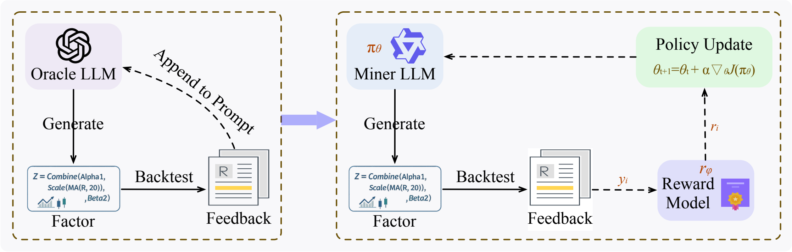
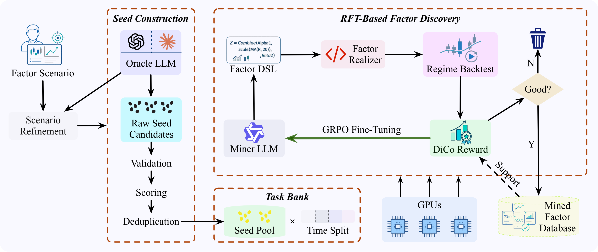

# QuantEvolver

QuantEvolver is a self-evolving framework for LLM-based alpha factor discovery. It is built around a simple idea: instead of repeatedly appending past candidates and feedback to an ever-growing prompt, QuantEvolver converts executable quantitative evaluation into policy-update signals, allowing a miner LLM to internalize factor-mining experience through reinforcement fine-tuning.

<p align="center">
  
</p>

Modern LLM-based factor mining systems commonly rely on prompt-level generation--evaluation--feedback loops. These loops are easy to prototype, but they can suffer from context explosion, feedback drift, dependence on very large models, and search stagnation. QuantEvolver provides a reusable codebase for a policy-update-driven alternative: seed construction, Factor DSL generation, executable backtesting, diversity/complementarity-aware reward shaping, and RFT-ready task/reward interfaces.

<p align="center">
  
</p>

## What is included

- **Scenario refinement**: rewrite a raw user scenario into a structured scenario config through an OpenAI-compatible LLM API.
- **Factor DSL**: generate compact, executable alpha expressions with syntax/type checks.
- **Seed construction**: generate, validate, score, deduplicate, and curate starting factors.
- **Task bank building**: combine seeds with configured evaluation windows for RFT training instances.
- **Executable evaluation**: evaluate single-asset and cross-sectional factors on local OHLCV data.
- **RFT utilities**: create Verl-compatible prompt datasets and token-level reward tensors for GRPO/RFT.
- **Mined factor output**: save validated high-quality factors with expression-level deduplication.

This public repository contains the reusable framework code only. It does not include private market data, trained checkpoints, experiment logs, or paper-specific reproduction scripts.

## Installation

```bash
python -m pip install -e .
```

Useful extras:

```bash
python -m pip install -e '.[backtest]'  # Backtrader + parquet support
# No extra package is needed for the stdlib OpenAI-compatible API client.
python -m pip install -e '.[dev]'       # tests/linting
```

The RFT path expects a working Verl/vLLM training environment. Install `.[rft]` for common Python dependencies, then follow the setup requirements of your training stack.

## Quick start

### 1. Refine a raw factor-mining scenario

Set your API key first:

```bash
export OPENAI_API_KEY=...
# Optional for non-OpenAI providers:
# export OPENAI_BASE_URL=https://your-provider/v1
```

Then run:

```bash
quantevolver refine-scenario \
  "5-minute bars for a liquid asset; discover factors for next-bar direction" \
  -o runs/scenario.yaml
```

### 2. Validate example seeds

```bash
quantevolver validate-seeds examples/seed_candidates.yaml \
  -o runs/seed_evaluations.yaml
```

### 3. Build a seed × time-window task bank

```bash
quantevolver build-task-bank runs/seed_evaluations.yaml \
  -c configs/example_seed_pipeline.yaml \
  -o runs/task_bank.yaml
```

### 4. Evaluate one DSL expression locally

Local evaluation expects OHLCV parquet files. By default files are read from `data/` using names such as `ASSET_1m.parquet`.

```bash
quantevolver rft-eval-expr 'div(ts_mean(returns(60)), ts_std(returns(60)))' \
  --symbol ASSET \
  --data-dir data \
  --bar-minutes 5 \
  --start-date 2024-01-01 \
  --end-date 2024-02-01
```

### 5. Prepare an RFT launch command

```bash
quantevolver rft-launch configs/example_rft_pure_verl.yaml --dry-run --print-command
```

This writes the generated launch command without starting training.

## Data format

Single-asset and cross-sectional evaluators expect local parquet files with a `DatetimeIndex` or a configured time column and the following columns:

```text
open, high, low, close, volume
```

For symbols containing `/`, QuantEvolver maps the symbol to a filesystem-safe filename using the configured template. For example, symbol `ASSET/QUOTE` maps to `ASSET_QUOTE_1m.parquet` under the default template `{symbol_safe}_1m.parquet`.

## Factor DSL examples

```text
div(ts_mean(returns(60)), ts_std(returns(60)))
neg(zscore(last(close(120)), close(120)))
corr(returns(60), log_arr(volume(60)))
sub(zscore(last(close(60)), close(60)), zscore(last(close(240)), close(240)))
```

## Repository layout

```text
quant_evolver/
  dsl/          Factor DSL compiler and interpreter
  evaluation/   Backtrader and cross-sectional evaluators
  rewards/      Reward profiles for direction, IC, RankIC, returns
  scenarios/    LLM-based scenario refinement
  seeds/        Seed generation, validation, scoring, curation
  rft/          Task-bank, prompt, reward-bridge, and Verl launch utilities
configs/        Minimal reusable example configs
examples/       Example seed candidates
assets/         Paper-style overview figures
tests/          Smoke tests for the public package
```

## Notes

- QuantEvolver is research software; it is not financial advice.
- The package does not ship market data or trained models.
- All symbols, data paths, task windows, model paths, and output locations should be set through configuration files or CLI arguments.
- Generated factors should always be validated out of sample before any real trading use.

We welcome researchers, developers, and practitioners interested in quantitative trading and alpha factor discovery to open issues, start discussions, or reach out for collaboration.
